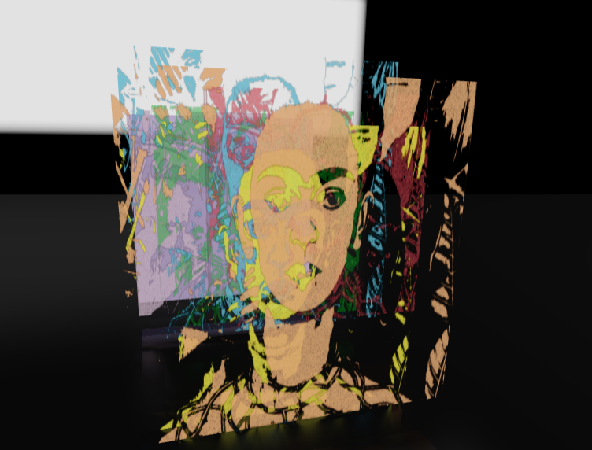
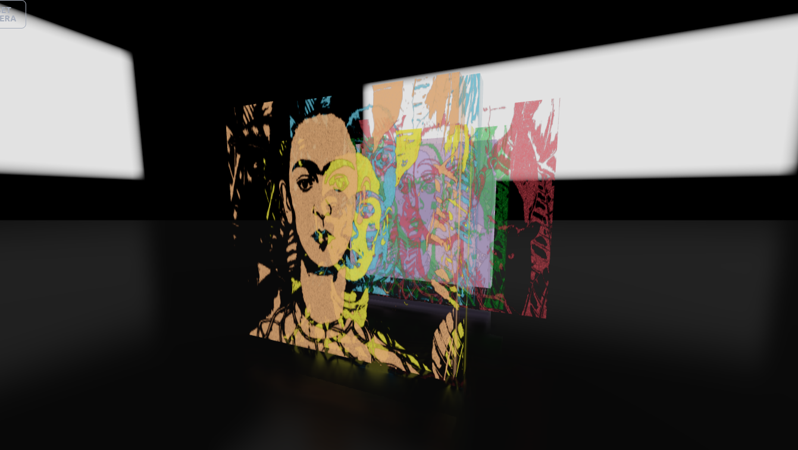
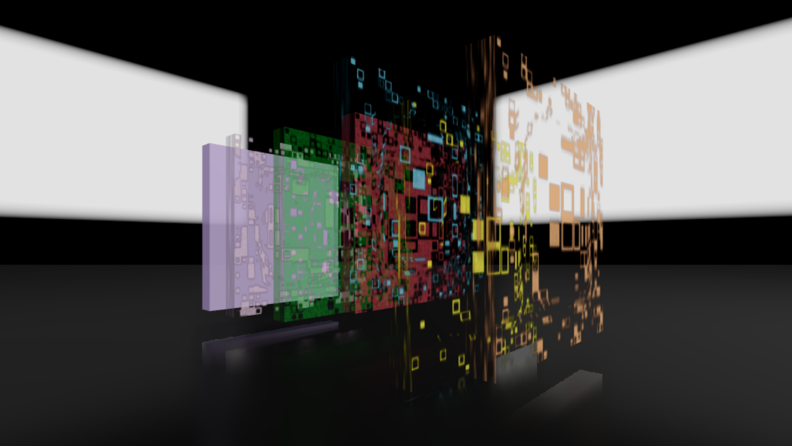
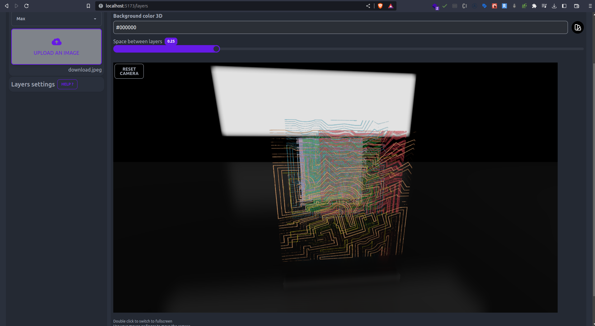
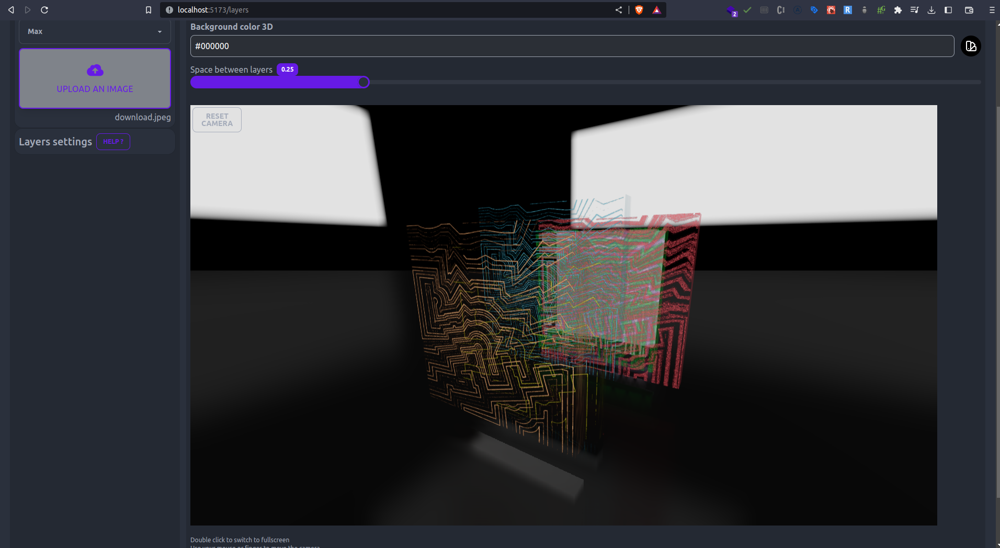
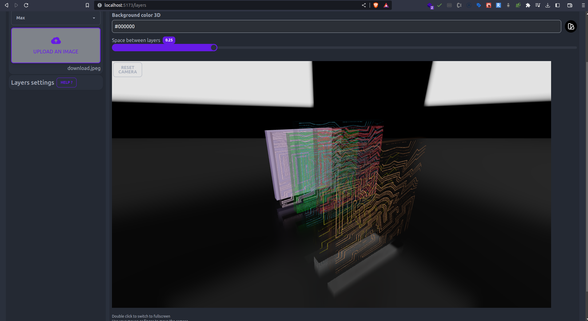
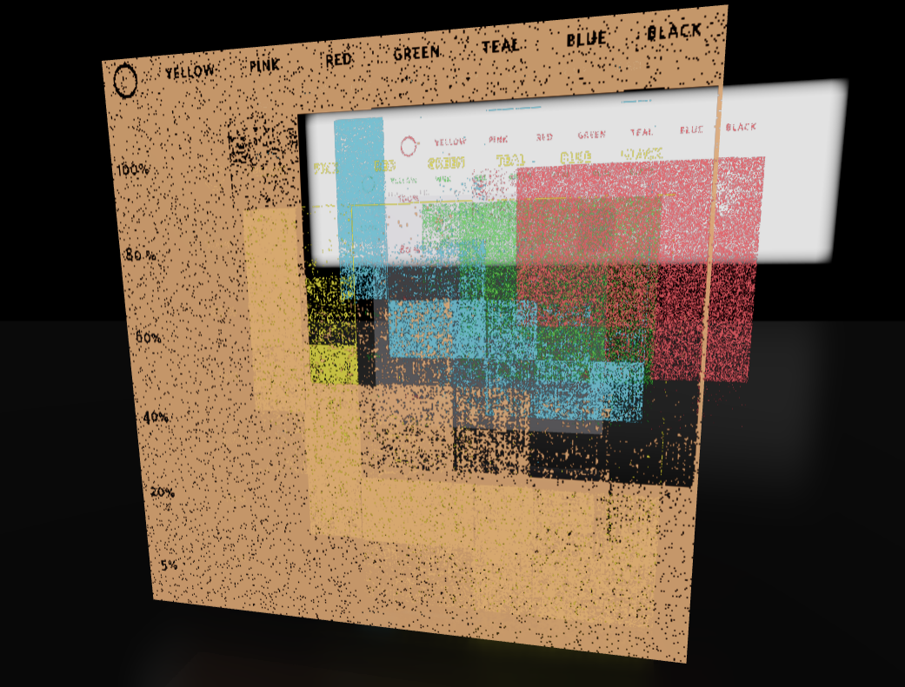
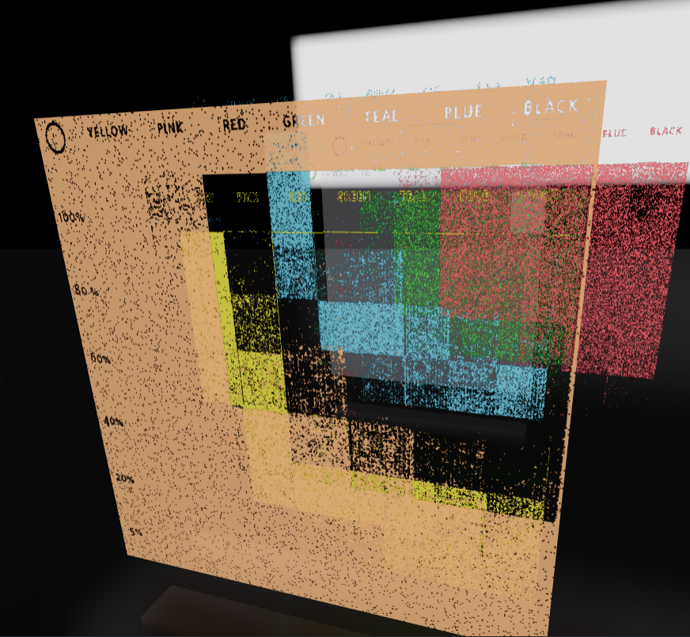

# Layers

Experiment about layering images based on pixels range.

## Examples

### Frida Kahlo

<table>
  <tr>
    <td>
            
    </td>
    <td>      
      
    </td>
  </tr>
</table>

### Vasarely

<table>
  <tr>
    <td>
            
    </td>
    <td>      
      
    </td>
    <td>      
      
    </td>
  </tr>
</table>

      

### Another example

<table>
  <tr>
    <td>
            
    </td>
    <td>      
      
    </td>
  </tr>
</table>

## Sources
Frida.jpg -> Saundra B. and William H. Lane Galleries
Vasarely -> vasarely-victor-album-gordes-ond-dva
Vasarely2 -> victor vasarely képei
